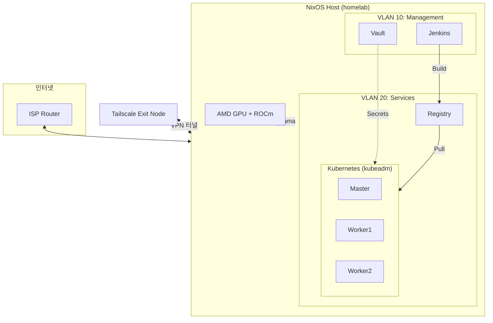

# Tony's Homelab

NixOS 기반 홈랩 인프라 - 선언적 서버 관리 및 MicroVM 가상화

## 개요

물리 서버에 NixOS를 설치하고 MicroVM으로 서비스를 운영하는 홈랩 인프라입니다.
Proxmox를 대체하며, 모든 설정이 코드로 관리됩니다.

**주요 특징**

- Domain-Driven Architecture (순수 데이터 도메인 + 플랫폼 어댑터)
- MicroVM 기반 경량 가상화
- kubeadm 기반 Kubernetes 클러스터
- AMD ROCm GPU 지원 (Hybrid 구성)
- sops-nix 암호화 시크릿
- Colmena 원격 배포
- Tailscale VPN Exit Node (공공 WiFi 보안 라우팅)

## 아키텍처



## 프로젝트 구조

```
.
├── flake.nix              # Nix Flake 진입점
├── configuration.nix      # 메인 NixOS 설정
├── home.nix               # Home-manager 진입점
│
├── lib/
│   ├── domains/           # 순수 데이터 도메인 (Single Source of Truth)
│   │   ├── shell.nix      # 쉘 별칭, 함수
│   │   ├── packages.nix   # 패키지 그룹 및 프로파일
│   │   ├── editor.nix     # 에디터 설정
│   │   ├── network.nix    # 네트워크 토폴로지
│   │   ├── vms.nix        # VM 정의
│   │   └── hosts.nix      # 호스트 정의
│   ├── adapters/          # 플랫폼별 어댑터
│   │   ├── nixos.nix      # Domain → NixOS 변환
│   │   └── home-manager.nix
│   └── profiles.nix       # 프로파일 접근 API
│
├── modules/
│   ├── nixos/             # NixOS 시스템 모듈
│   └── home-manager/      # 사용자 환경 모듈
│
├── vms/                   # MicroVM 정의
└── secrets/               # sops 암호화 시크릿
```

## Domain-Driven Architecture

모듈 중첩을 최소화하고 설정 중복을 제거하기 위해 도메인 기반 아키텍처를 사용합니다.

```
Domain (순수 데이터) → Adapter (변환) → NixOS/Home-manager
```

**프로파일 시스템:**

| 프로파일 | 용도 | 포함 그룹 |
|----------|------|-----------|
| minimal | 최소 환경 | core, shell |
| server | 서버 관리 | + editor, network, monitoring, dev, hardware |
| k8s-node | K8s 노드 | + k8s |
| dev | 개발 환경 | + terminal |
| full | 워크스테이션 | 전체 |

## 빠른 시작

### 사전 요구사항

- Nix (flakes 활성화)
- sops, age (시크릿 관리)
- just (작업 자동화)

### 기본 명령어

```bash
# 설정 검증
just check

# 빌드
just build

# 배포
just deploy

# VM 상태 확인
just vm-status
```

### 부분 배포

```bash
# 특정 노드만
just deploy homelab
just deploy k8s-master

# VM 전체
just deploy vms
```

## Tailscale VPN (Exit Node)

공공 WiFi 등 외부 네트워크에서 홈랩을 경유하여 안전하게 인터넷을 사용할 수 있습니다.

```
클라이언트 (공공WiFi) → Tailscale 터널 → 홈랩 (Exit Node) → 인터넷
```

**구성 요소:**
- `--advertise-exit-node`: 홈랩을 Exit Node로 광고
- `--netfilter-mode=nodivert`: Bridge/VLAN/NAT 규칙 보호
- 수동 MASQUERADE: nodivert 환경에서 Exit Node NAT 보장

**사용 방법:**

```bash
# 클라이언트에서 Exit Node 활성화
tailscale set --exit-node=<홈랩-Tailscale-IP>

# 확인 (홈랩 공인 IP가 나와야 함)
curl ifconfig.me

# 해제
tailscale set --exit-node=
```

> **참고:** Tailscale Admin Console에서 해당 노드의 Exit Node를 승인해야 합니다.
> `nodivert` 모드의 상세 배경은 [`modules/nixos/tailscale.nix`](./modules/nixos/tailscale.nix) 주석을 참고하세요.

## Kubernetes 클러스터

kubeadm 기반 수동 클러스터 구성:

```bash
# Master 초기화
ssh k8s-master "kubeadm init --pod-network-cidr=10.244.0.0/16"

# Worker 조인
ssh k8s-worker-1 "kubeadm join <master-ip>:6443 --token <token> --discovery-token-ca-cert-hash <hash>"

# CNI 배포 (Flannel)
kubectl apply -f https://raw.githubusercontent.com/flannel-io/flannel/master/Documentation/kube-flannel.yml
```

## GPU 구성 (Hybrid)

호스트에서 AMD ROCm으로 GPU 워크로드 실행:

- GPU passthrough 대신 호스트 직접 실행
- Ollama 등 AI 워크로드 지원
- K8s와 호스트 간 하이브리드 운영

## 문서

| 디렉토리 | 설명 |
|----------|------|
| [lib/](./lib/README.md) | 도메인 및 인프라 상수 |
| [modules/](./modules/README.md) | NixOS/Home-manager 모듈 |
| [vms/](./vms/README.md) | MicroVM 정의 |
| [secrets/](./secrets/README.md) | 시크릿 관리 |
| [docs/](./docs/) | 상세 문서 |

## 참고 자료

- [NixOS Manual](https://nixos.org/manual/nixos/stable/)
- [MicroVM.nix](https://github.com/astro/microvm.nix)
- [Colmena](https://github.com/zhaofengli/colmena)
- [sops-nix](https://github.com/Mic92/sops-nix)
