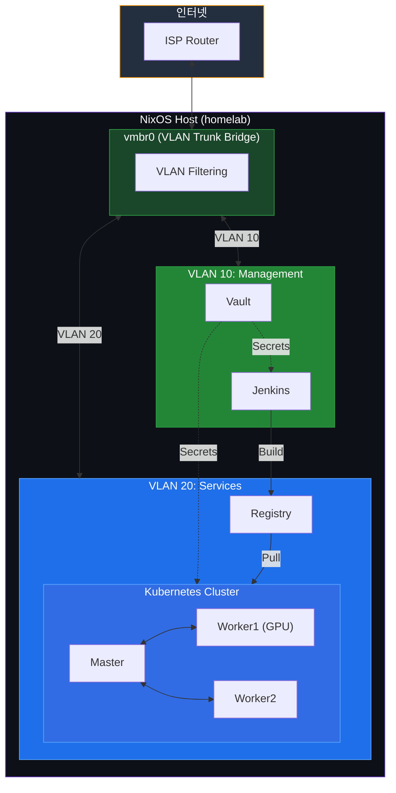

# Tony's Homelab

NixOS 기반 홈랩 인프라 - 선언적 서버 관리 및 MicroVM 가상화

## 개요

물리 서버에 NixOS를 설치하고 MicroVM으로 서비스를 운영하는 홈랩 인프라입니다.
Proxmox를 대체하며, 모든 설정이 코드로 관리됩니다.

**주요 특징**

- 선언적 인프라 관리 (Nix Flakes)
- MicroVM 기반 경량 가상화
- VLAN 기반 네트워크 분리
- sops-nix 암호화 시크릿
- Colmena 원격 배포
- 롤백 지원 (NixOS 세대 관리)

## 아키텍처



## 모듈 구조

프로젝트는 모듈 기반으로 구성되어 있습니다. 각 디렉토리의 상세 설명은 해당 README를 참조하세요.

| 모듈         | 설명                                 | 문서                                     |
| ------------ | ------------------------------------ | ---------------------------------------- |
| **lib/**     | 인프라 상수 (Single Source of Truth) | [lib/README.md](./lib/README.md)         |
| **modules/** | NixOS 및 Home-manager 모듈           | [modules/README.md](./modules/README.md) |
| **vms/**     | MicroVM 정의                         | [vms/README.md](./vms/README.md)         |
| **secrets/** | 암호화된 시크릿                      | [secrets/README.md](./secrets/README.md) |

### 핵심 설정 파일

| 파일                | 역할                                    |
| ------------------- | --------------------------------------- |
| `flake.nix`         | Nix Flake 진입점, 의존성 관리           |
| `configuration.nix` | 메인 NixOS 설정                         |
| `disko-config.nix`  | 디스크 파티셔닝 (LVM thin provisioning) |
| `colmena.nix`       | 원격 배포 설정 (flake.nix 내 정의)      |
| `justfile`          | 작업 자동화 명령어                      |

## 빠른 시작

### 사전 요구사항

- Nix (flakes 활성화)
- sops, age (시크릿 관리)
- just (작업 자동화)
- SSH 설정 (`~/.ssh/config`에 homelab 호스트 등록)

```bash
# ~/.ssh/config 예시
Host homelab
  HostName 192.xxx.xxx.xxx
  User limjihoon
  IdentityFile ~/.ssh/your-key
```

### 초기 배포

```bash
# 1. SSH 공개키 설정
mkdir -p secrets
cat ~/.ssh/your-key.pub > secrets/ssh-public-key.txt

# 2. Secrets 설정 (.sops.yaml에 age 키 설정 필요)
ssh homelab "cat /etc/ssh/ssh_host_ed25519_key.pub | ssh-to-age"

# 3. 전체 배포
just init
```

## 사용법

### Secrets 관리 (sops-nix)

시크릿은 `secrets/secrets.yaml`에 암호화되어 저장됩니다.

```bash
# 서버의 age 키 확인
ssh homelab "cat /etc/ssh/ssh_host_ed25519_key.pub | ssh-to-age"

# secrets.yaml 편집 (자동 암호화/복호화)
sops secrets/secrets.yaml

# 패스워드 해시 생성
ssh homelab "mkpasswd -m sha-512"
```

**설정 위치:** `modules/nixos/sops.nix`

### 배포 (Colmena)

```bash
# 설정 검증
just check

# 빌드만 (dry-run)
just build

# 프로덕션 배포
just deploy
```

**배포 방식:** Colmena가 SSH로 homelab에 연결하여 원격 빌드 및 적용

#### 부분 배포 (태그/노드)

```bash
# homelab 노드만 적용
colmena apply --on @homelab

# VM 개별 태그로 적용
colmena apply --on @vm-vault,@vm-jenkins,@vm-registry,@vm-k8s-master,@vm-k8s-worker-1,@vm-k8s-worker-2

# Kubernetes 노드만 적용
colmena apply --on @k8s

# 특정 VM만 적용
colmena apply --on k8s-master
```

#### just 배포 단축 명령

```bash
# 단일 노드 배포
just deploy jenkins

# opnsense는 homelab에서만 관리
just deploy homelab

# homelab만 배포
just deploy homelab

# VM 전체 배포 (개별 태그 모음)
just deploy vms

# 호스트 -> vm_order 순차 배포
just deploy-all
```

#### just 빌드 단축 명령

```bash
# 단일 노드 빌드
just build jenkins

# homelab만 빌드
just build homelab

# VM 전체 빌드 (개별 태그 모음)
just build vms

# 호스트 -> vm_order 순차 빌드
just build-all
```

### MicroVM 관리

```bash
# VM 상태 확인
just vm-status

# VM 시작/중지/재시작
just vm-start <vm-name>
just vm-stop <vm-name>
just vm-restart <vm-name>

# VM SSH 접속 (Jump host 경유)
just vm-ssh-vault
just vm-ssh-jenkins
just vm-ssh-registry
just vm-ssh-k8s-master
just vm-ssh-k8s-worker1
just vm-ssh-k8s-worker2

# VM 연결 상태 확인
just vm-ping

# VM 로그 확인
just vm-logs <vm-name>
```

### 버전 관리 및 롤백

NixOS 세대(generation)를 활용한 롤백:

```bash
# 세대 목록 확인
just version-list

# 현재 세대 정보
just version-current

# 이전 세대로 롤백
just version-rollback

# 특정 세대로 롤백
just version-rollback-to <generation>

# 세대 비교
just version-diff <from> <to>

# 오래된 세대 정리 (N일 이상)
just version-cleanup <days>
```

### 네트워크 디버깅

```bash
# 네트워크 토폴로지 확인
just net-show

# VLAN 상태 확인
just net-check-vlan

# 종합 네트워크 진단
just net-diagnose

# 트래픽 모니터링
just net-monitor-traffic 10  # VLAN 10
just net-monitor-traffic 20  # VLAN 20
```

### Justfile 명령어 요약

| 카테고리     | 명령어                                             | 설명                         |
| ------------ | -------------------------------------------------- | ---------------------------- |
| **개발**     | `check`, `build`, `fmt`, `update`                  | 검증, 빌드, 포맷팅, 업데이트 |
| **배포**     | `deploy`, `init`                                   | 프로덕션 배포, 초기 설정     |
| **VM**       | `vm-status`, `vm-start`, `vm-stop`, `vm-ssh-*`     | VM 관리                      |
| **버전**     | `version-list`, `version-rollback`, `version-diff` | 세대 관리                    |
| **네트워크** | `net-show`, `net-diagnose`, `net-check-vlan`       | 네트워크 디버깅              |
| **유틸리티** | `ssh`, `status`, `clean`                           | 일반 유틸리티                |

전체 명령어: `just --list`

## 주의사항

### 보안

- **SSH root 로그인**: 현재 개발 편의상 VM에서 root SSH 로그인이 활성화되어 있음
- **빈 패스워드**: 일부 VM에서 개발용 빈 패스워드 설정됨 - 프로덕션 전 변경 필요
- **시크릿 파일**: `secrets/` 디렉토리의 파일은 `.gitignore`에 포함되어야 함
- **age 키**: 서버의 SSH 호스트 키가 age 키로 사용됨 - 키 교체 시 secrets 재암호화 필요

### 네트워크

- **VLAN 격리**: VLAN 10(관리)과 VLAN 20(서비스)은 논리적으로 분리됨
- **NAT**: VM은 호스트를 통해 NAT로 외부 접속
- **IP 변경**: IP 변경 시 `lib/homelab-constants.nix` 수정 필요 (Single Source of Truth)

### 배포

- **초기 배포**: `just init`은 스토리지 디렉토리 생성 포함 - 데이터 손실 주의
- **롤백**: 커널 변경이 포함된 경우 `version-rollback-reboot` 사용 권장
- **세대 정리**: 주기적으로 `version-cleanup`으로 디스크 공간 확보

### 스토리지

- **LVM Thin Provisioning**: SSD 최적화를 위해 thin pool 사용
- **오버커밋**: VM 스토리지는 2x 오버커밋 (380GB 물리 → 800GB 논리)
- **fstrim**: 자동 실행으로 SSD 수명 관리

## 디스크 구성

| 파티션        | 크기                        | 용도                |
| ------------- | --------------------------- | ------------------- |
| ESP           | 1GB                         | EFI 부트            |
| Swap          | 16GB                        | 스왑 (암호화)       |
| root          | 200GB                       | NixOS 시스템        |
| vm_thinpool   | 380GB (물리) / 800GB (논리) | VM 스토리지         |
| data_thinpool | 300GB (물리) / 600GB (논리) | 애플리케이션 데이터 |
| vault         | 20GB                        | 보안 스토리지       |

**최소 디스크 요구사항:** 920GB

## 참고 자료

- [NixOS Manual](https://nixos.org/manual/nixos/stable/)
- [MicroVM.nix](https://github.com/astro/microvm.nix)
- [Colmena](https://github.com/zhaofengli/colmena)
- [sops-nix](https://github.com/Mic92/sops-nix)
- [disko](https://github.com/nix-community/disko)
