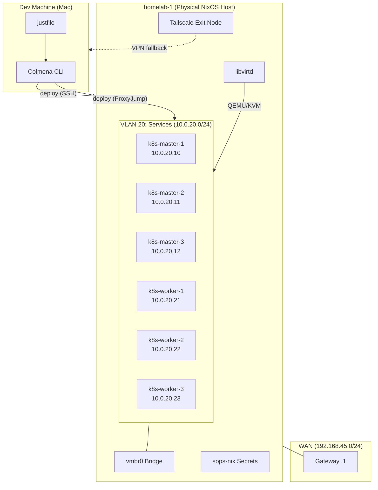

# Tony's Homelab

NixOS + libvirt + Colmena 기반 선언적 홈랩 인프라.
물리 서버 위에 libvirt QEMU/KVM으로 Kubernetes 클러스터를 운영합니다.

```bash
just deploy        # 물리호스트 → VM 순서로 전체 배포
just ssh k8s-master-1  # VM SSH 접속
just k8s deploy    # K8s 클러스터 부트스트랩/수렴
```

## Table of Contents

- [Architecture](#architecture)
- [Directory Structure](#directory-structure)
- [Quick Start](#quick-start)
- [Operations](#operations)

## Architecture


```mermaid
flowchart TB
  subgraph Mac["Dev Machine (Mac)"]
    Colmena["Colmena CLI"]
    Just["justfile"]
  end

  subgraph Host["homelab-1 (Physical NixOS Host)"]
    Libvirt["libvirtd"]
    Bridge["vmbr0 Bridge"]
    TS["Tailscale Exit Node"]
    SOPS["sops-nix Secrets"]

    subgraph VLAN20["VLAN 20: Services (10.0.20.0/24)"]
      M1["k8s-master-1<br/>10.0.20.10"]
      M2["k8s-master-2<br/>10.0.20.11"]
      M3["k8s-master-3<br/>10.0.20.12"]
      W1["k8s-worker-1<br/>10.0.20.21"]
      W2["k8s-worker-2<br/>10.0.20.22"]
      W3["k8s-worker-3<br/>10.0.20.23"]
    end
  end

  subgraph WAN["WAN (192.168.45.0/24)"]
    GW["Gateway .1"]
  end

  Just --> Colmena
  Colmena -->|"deploy (SSH)"| Host
  Colmena -->|"deploy (ProxyJump)"| VLAN20
  Libvirt -->|"QEMU/KVM"| VLAN20
  Host --- Bridge --- VLAN20
  Host --- GW
  TS -.->|"VPN fallback"| Mac
```

**핵심 구성요소:**

| 구성 | 설명 | 참조 |
|------|------|------|
| [Colmena](https://github.com/zhaofengli/colmena) | NixOS 원격 배포 | `lib/mk-colmena.nix` |
| [libvirt](https://libvirt.org/) | VM 관리 (QEMU/KVM) | `lib/mk-libvirt.nix` |
| [sops-nix](https://github.com/Mic92/sops-nix) | 암호화된 시크릿 | `atoms/system/sops.nix` |
| IaC Contract | 노드별 옵션 인터페이스 | `nodes/interface.nix` |

## Directory Structure

```
.
├── flake.nix                  # Nix Flake 진입점
├── justfile                   # 운영 명령어 (deploy, ssh, k8s, ...)
├── network/
│   └── topology.nix           # CIDR/VLAN/호스트/VM 네트워크 상수
├── lib/                       # Colmena hive + libvirt 빌드 헬퍼
├── nodes/                     # IaC Contract + 노드 정의 (물리/VM/역할)
├── atoms/                     # 재사용 가능한 NixOS 모듈 조각
├── ansible/                   # K8s 부트스트랩 (kubeadm + Cilium)
└── secrets/                   # sops-nix 암호화 시크릿
```

각 디렉토리의 상세 설명은 디렉토리 내 `README.md`를 참조하세요.

## Quick Start

### 사전 요구

- Nix (flakes), sops, age, just, jq, tailscale

### SSH 설정 (필수)

Colmena와 justfile이 안정적으로 동작하려면 `~/.ssh/config` 설정이 필요합니다.
배포 시 Hang 현상을 방지하기 위해 **복잡한 ProxyCommand 대신 고정 IP(LAN 또는 Tailscale)를 사용**하는 것을 권장합니다.

```ssh-config
# 1. 물리 호스트 (homelab-1)
# 로컬(집): 192.168.45.82 사용
# 원격(외부): Tailscale 활성화 후 Tailscale IP(100.x.y.z) 또는 MagicDNS 사용
Host homelab-1
    HostName 100.x.y.z       # 또는 192.168.45.82
    User limjihoon
    IdentityFile ~/.ssh/homelab.pem
    # 대량 배포(Colmena/Ansible) 시 연결 재사용으로 속도 향상
    ControlMaster auto
    ControlPath ~/.ssh/master-%r@%h:%p
    ControlPersist 10m

# 2. VM 노드 (ProxyJump 설정)
# 모든 VM은 물리 호스트(homelab-1)를 경유하여 접속합니다.
Host 10.0.20.* k8s-master-* k8s-worker-*
    User root
    ProxyJump homelab-1
    StrictHostKeyChecking no
    UserKnownHostsFile /dev/null
```

> **Tip:** Tailscale MagicDNS(`homelab-1.your-tailnet.ts.net`)를 사용하면 장소에 관계없이 자동으로 최적의 경로를 찾아 연결되므로 가장 편리합니다.

### 배포

```bash
# 검증
just check

# 전체 배포 (호스트 -> VM 순서)
just deploy

# 특정 노드만 배포
just deploy node homelab-1
just deploy node k8s-master-1 k8s-worker-1
```

## Operations

```bash
# SSH (LAN/Tailscale 자동 감지)
just ssh homelab-1        # 물리 호스트
just ssh k8s-master-1     # VM (ProxyJump 자동)

# VM 관리
just vm start k8s-master-1
just vm stop all
just vm status

# 시스템 점검
just k8s verify           # K8s 클러스터 상세 점검
just flux status          # Flux 리소스 상태

# 로컬/CI 검증
just check                # 전체 guardrail
just check k8s            # kustomize + kubeconform + kube-linter + Kyverno
just check nix            # deadnix + statix 리포트 + alejandra + flake check
just check docs           # 문서의 just 명령어 정합성 검사

# K8s 클러스터
just k8s deploy           # bootstrap -> verify
just k8s bootstrap        # 초기 부트스트랩
CONFIRM_RESET=homelab just k8s clean        # 클러스터 리셋
CONFIRM_RESET=homelab just k8s reset-deploy # reset -> bootstrap -> verify

# 유지보수
just gc                   # 전체 노드 가비지 컬렉션
just gc homelab-1         # 특정 노드만
just update               # flake 업데이트
```
