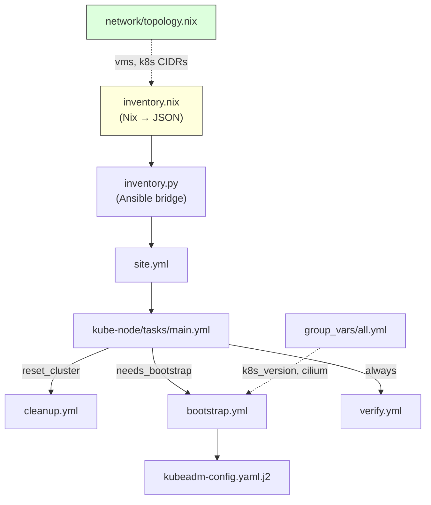

# ansible/ — Kubernetes 부트스트랩

kubeadm + Cilium CNI 기반 K8s 클러스터 부트스트랩을 Ansible로 오케스트레이션합니다.
NixOS가 시스템 구성을 담당하고, Ansible은 K8s 초기화/조인/검증만 처리합니다.

```bash
just k8s deploy       # bootstrap -> verify
CONFIRM_RESET=homelab just k8s reset-deploy # reset -> bootstrap -> verify
just k8s bootstrap    # 초기 부트스트랩만
just k8s verify       # 클러스터 건강 점검
```

## Table of Contents

- [WHAT](#what)
- [HOW](#how)

## WHAT



| 파일 | 역할 |
|------|------|
| `inventory.nix` | `topology.nix`에서 VM 목록/IP/K8s 상수를 Ansible JSON 인벤토리로 변환 |
| `inventory.py` | `nix eval`을 호출하여 인벤토리를 stdout으로 출력 (Ansible dynamic inventory) |
| `site.yml` | Playbook 진입점 — `kube-node` 역할 적용 |
| `group_vars/all.yml` | K8s 버전, Cilium MTU/namespace 등 전역 변수 |
| `roles/kube-node/tasks/main.yml` | 오케스트레이터 — VIP 바인딩, bootstrap 판단, cleanup/bootstrap/verify 분기 |
| `roles/kube-node/tasks/bootstrap.yml` | kubeadm init (리더) → Cilium install → join (secondary masters/workers) |
| `roles/kube-node/tasks/cleanup.yml` | kubeadm reset + 잔여 프로세스/파일 정리 |
| `roles/kube-node/tasks/verify.yml` | API healthz + 노드 Ready 확인 + pod 상태 보고 |
| `roles/kube-node/templates/kubeadm-config.yaml.j2` | kubeadm InitConfiguration + ClusterConfiguration |

## HOW

**인벤토리 흐름 (`data` 의존성 없음):**

```
network/topology.nix → ansible/inventory.nix → inventory.py → Ansible
```

`inventory.nix`는 `topology.nix.vms`에서 VM 이름과 role/cluster/network 필드를
직접 읽어 그룹과 hostvars 를 생성합니다. 이름 패턴이나 IP 프리픽스 추론에
의존하지 않습니다.

**부트스트랩 순서:**

1. 리더 master (`groups['k8s_masters'][0]`) — `kubeadm init` + Cilium 설치
2. API 안정화 대기 (15초)
3. Secondary masters — `kubeadm join --control-plane` (throttle: 1)
4. Workers — `kubeadm join`

**Reset guard:**

`just k8s clean` 과 `just k8s reset-deploy` 는 destructive reset 경로입니다.
실행하려면 `CONFIRM_RESET=homelab` 를 지정해야 하며, cleanup 은 다음 상태를
삭제합니다: `/etc/kubernetes`, `/var/lib/etcd`, `/var/lib/kubelet`,
`/etc/cni/net.d`, `/etc/systemd/system/kubelet.service.d`.

**관련 라이브러리:**
- [kubeadm](https://kubernetes.io/docs/setup/production-environment/tools/kubeadm/)
- [Cilium Helm](https://docs.cilium.io/en/stable/installation/k8s-install-helm/)
