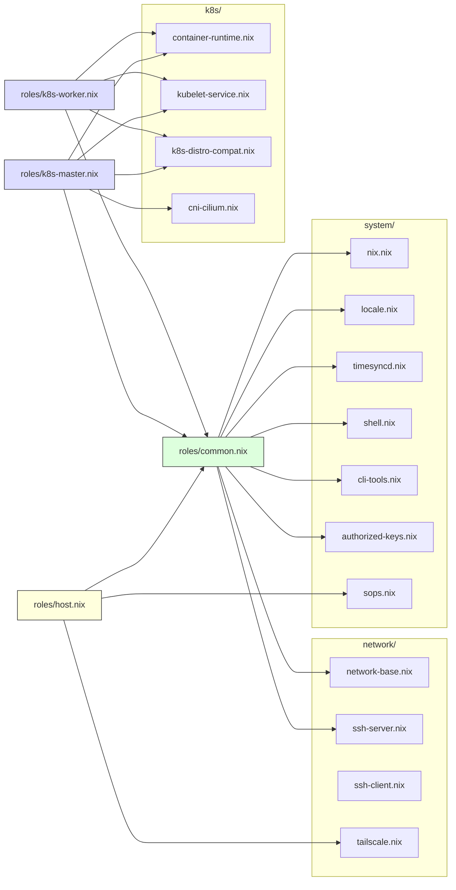

# atoms/ — 재사용 가능한 NixOS 모듈 조각

하나의 관심사만 담당하는 최소 단위 NixOS 모듈입니다.
`nodes/roles/*.nix`에서 조합되어 노드에 적용됩니다.

```nix
# 사용 예: nodes/roles/common.nix
imports = [
  ../../atoms/system/nix.nix
  ../../atoms/network/ssh-server.nix
  ../../atoms/network/network-base.nix
];
```

## Table of Contents

- [WHAT](#what)

## WHAT



| Atom | 역할 |
|------|------|
| `system/nix.nix` | Nix 설정 (flakes, gc) |
| `system/locale.nix` | 시간대, 로케일 |
| `system/timesyncd.nix` | 시간 동기화 (NTP) |
| `system/shell.nix` | 기본 쉘 설정 |
| `system/cli-tools.nix` | 공통 CLI 도구 |
| `system/authorized-keys.nix` | SSH 공개키 |
| `system/sops.nix` | sops-nix 기본 설정 (물리 호스트 전용) |
| `network/network-base.nix` | systemd-networkd + 기본 방화벽 |
| `network/ssh-server.nix` | SSH 서버 |
| `network/ssh-client.nix` | SSH 클라이언트 (VM 호스트 이름 매핑) |
| `network/tailscale.nix` | Tailscale VPN + Exit Node |
| `k8s/container-runtime.nix` | containerd CRI |
| `k8s/kubelet-service.nix` | kubelet systemd 서비스 |
| `k8s/k8s-distro-compat.nix` | NixOS-K8s 호환 패치 |
| `k8s/cni-cilium.nix` | Cilium CNI 사전 설정 |
