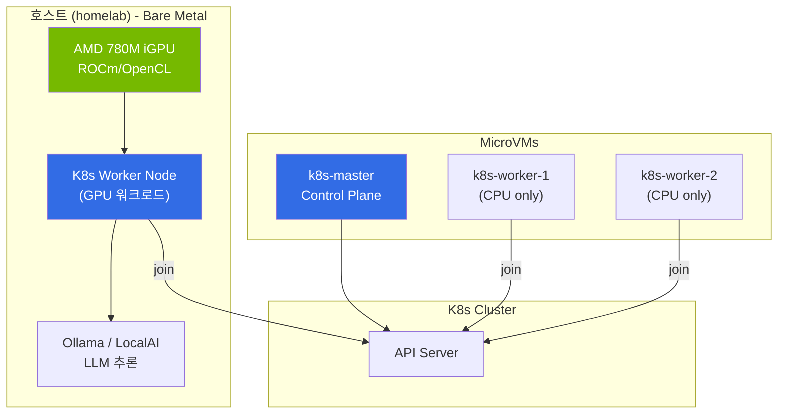
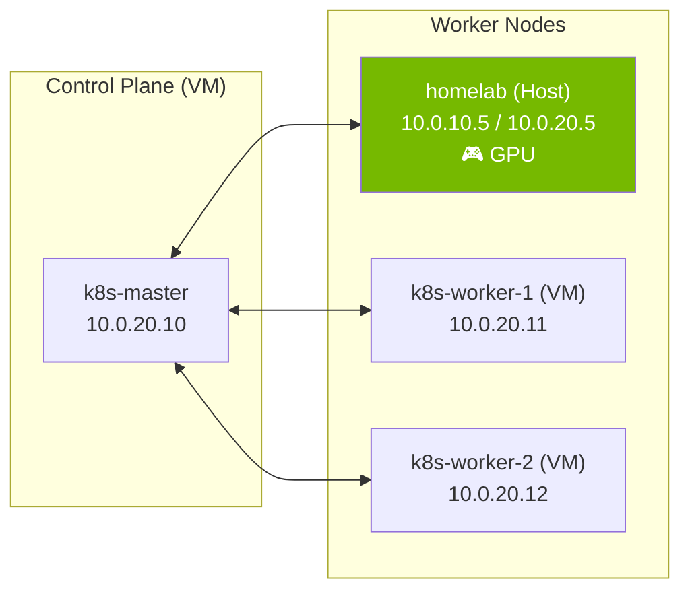
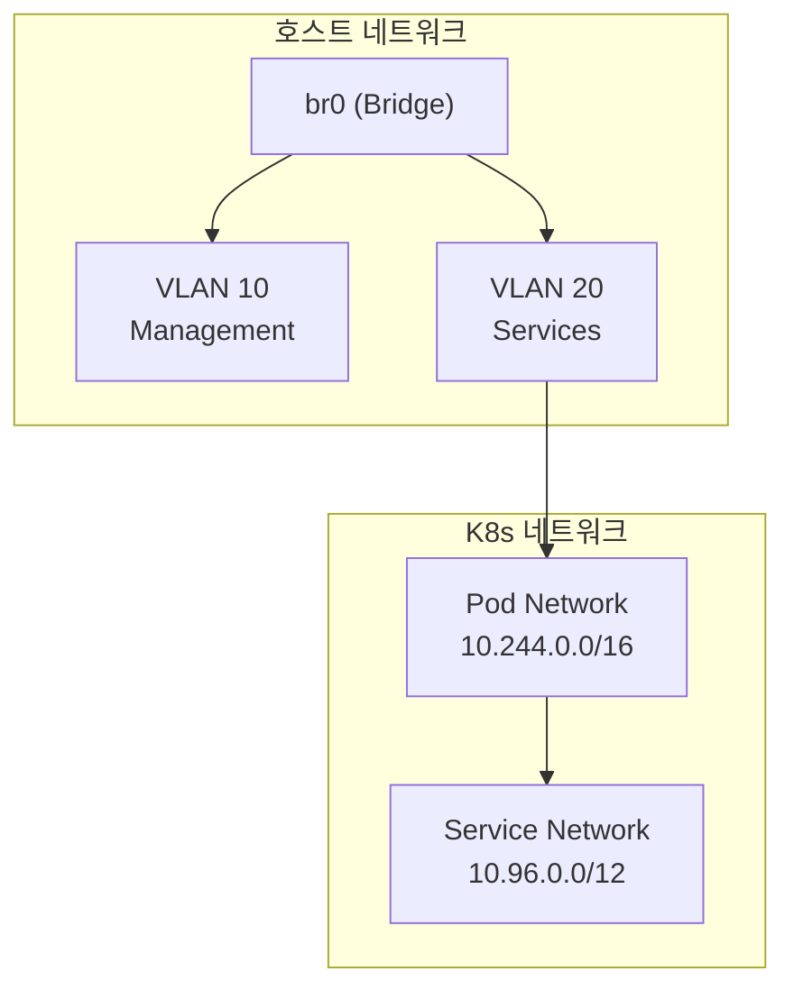
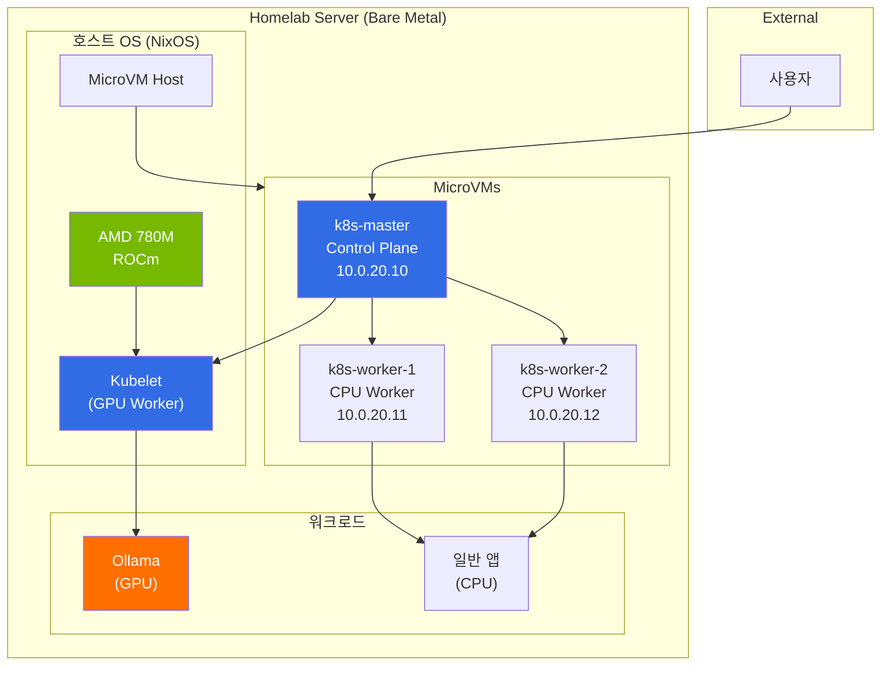

# Hybrid K8s Cluster 구현 계획

## 개요

AMD Hawk Point iGPU (Radeon 780M)의 VM passthrough 한계로 인해, **호스트에서 직접 GPU를 활용**하는 Hybrid Cluster 구성을 진행합니다.



---

## Phase 1: GPU 비활성화 및 정리

### 목표
k8s-worker-1에서 GPU passthrough 설정을 제거하고 안정적인 VM 운영 환경 구축

### 작업 항목

#### 1.1 GPU Passthrough 비활성화
```nix
# lib/homelab-constants.nix
gpu = {
  enable = false;  # true → false
  # ... 나머지 설정 유지 (나중 참고용)
};
```

#### 1.2 VFIO 커널 파라미터 제거
```nix
# modules/nixos/boot.nix
kernelParams = [
  "amd_iommu=on"
  "iommu=pt"
  # vfio-pci.ids=1002:1900 제거
];
```

#### 1.3 VM 커널 파라미터 정리
```nix
# vms/k8s-worker-1.nix
# amdgpu 관련 커널 파라미터 모두 제거
boot.kernelParams = []; # GPU 관련 파라미터 제거
```

### 확인 명령어
```bash
# 배포 후 VM 상태 확인
just deploy
just vm-ping

# k8s-worker-1 정상 부팅 확인
ssh root@10.0.20.11 "systemctl is-system-running"
```

---

## Phase 2: 호스트 AMD GPU 설정

### 목표
호스트에서 AMD iGPU를 직접 사용하도록 ROCm 환경 구성

### 작업 항목

#### 2.1 AMD GPU 드라이버 설정
```nix
# modules/nixos/amdgpu.nix (신규 생성)
{ pkgs, ... }: {
  # AMD GPU 드라이버 initrd 로딩
  hardware.amdgpu.initrd.enable = true;

  # OpenCL 지원
  hardware.graphics = {
    enable = true;
    extraPackages = with pkgs; [
      rocmPackages.clr.icd
      rocmPackages.clr
    ];
  };

  # ROCm 환경 변수
  environment.variables = {
    ROC_ENABLE_PRE_VEGA = "1";  # gfx1103 지원
  };
}
```

#### 2.2 ROCm 패키지 설치
```nix
# modules/nixos/amdgpu.nix (계속)
environment.systemPackages = with pkgs; [
  rocmPackages.rocm-smi      # GPU 모니터링
  rocmPackages.rocminfo      # GPU 정보
  rocmPackages.clinfo        # OpenCL 정보

  # AI/ML 워크로드용
  rocmPackages.hip           # HIP 런타임
  rocmPackages.rocblas       # BLAS 라이브러리
];
```

#### 2.3 사용자 그룹 설정
```nix
# modules/nixos/users.nix 또는 amdgpu.nix
users.users.limjihoon.extraGroups = [ "video" "render" ];
```

### 확인 명령어
```bash
# GPU 인식 확인
rocm-smi

# OpenCL 디바이스 확인
clinfo | grep -i "device name"

# GPU 메모리 확인
cat /sys/class/drm/card0/device/mem_info_vram_total
```

---

## Phase 3: 호스트 K8s Worker 설정

### 목표
호스트를 K8s worker node로 구성하여 기존 VM 클러스터에 join

### 아키텍처


### 작업 항목

#### 3.1 호스트 K8s Worker 모듈 생성
```nix
# modules/nixos/k8s-worker-host.nix (신규 생성)
{ pkgs, homelabConstants, ... }: let
  masterInfo = homelabConstants.vms.k8s-master;
in {
  # K8s 커널 모듈
  boot.kernelModules = [ "overlay" "br_netfilter" ];
  boot.kernel.sysctl = {
    "net.bridge.bridge-nf-call-iptables" = 1;
    "net.ipv4.ip_forward" = 1;
  };

  # 컨테이너 런타임
  virtualisation.containerd.enable = true;

  # Kubelet 설정
  services.kubernetes = {
    roles = [ "node" ];
    masterAddress = masterInfo.ip;
    apiserverAddress = "https://${masterInfo.ip}:${toString masterInfo.ports.api}";
    easyCerts = true;

    kubelet = {
      kubeconfig.server = "https://${masterInfo.ip}:${toString masterInfo.ports.api}";
      extraOpts = "--node-labels=gpu=amd,node-type=baremetal";
    };
  };

  # K8s 도구
  environment.systemPackages = with pkgs; [
    kubectl
    kubernetes
  ];

  # 방화벽
  networking.firewall.allowedTCPPorts = [
    10250  # kubelet
  ];
  networking.firewall.allowedTCPPortRanges = [
    { from = 30000; to = 32767; }  # NodePort
  ];
}
```

#### 3.2 configuration.nix에 모듈 추가
```nix
# configuration.nix
imports = [
  # ... 기존 imports
  ./modules/nixos/amdgpu.nix
  ./modules/nixos/k8s-worker-host.nix
];
```

#### 3.3 homelab-constants.nix에 호스트 노드 정보 추가
```nix
# lib/homelab-constants.nix
hosts = {
  homelab = {
    # ... 기존 설정
    k8s = {
      role = "worker";
      labels = {
        "gpu" = "amd";
        "node-type" = "baremetal";
      };
    };
  };
};
```

### 확인 명령어
```bash
# 호스트에서 kubelet 상태 확인
sudo systemctl status kubelet

# 클러스터 노드 목록 (master에서)
kubectl get nodes -o wide

# 노드 레이블 확인
kubectl get nodes --show-labels
```

---

## Phase 4: GPU 워크로드 배포

### 목표
호스트 GPU를 활용하는 AI/ML 워크로드 (Ollama) 배포

### 작업 항목

#### 4.1 AMD GPU Device Plugin (선택사항)
```yaml
# k8s/amd-gpu-device-plugin.yaml
apiVersion: apps/v1
kind: DaemonSet
metadata:
  name: amd-gpu-device-plugin
  namespace: kube-system
spec:
  selector:
    matchLabels:
      name: amd-gpu-device-plugin
  template:
    spec:
      nodeSelector:
        gpu: amd
      containers:
      - name: amd-gpu-device-plugin
        image: rocm/k8s-device-plugin
        securityContext:
          privileged: true
        volumeMounts:
        - name: dev
          mountPath: /dev
      volumes:
      - name: dev
        hostPath:
          path: /dev
```

#### 4.2 Ollama 배포 (GPU 노드 타겟팅)
```yaml
# k8s/ollama.yaml
apiVersion: apps/v1
kind: Deployment
metadata:
  name: ollama
spec:
  replicas: 1
  selector:
    matchLabels:
      app: ollama
  template:
    metadata:
      labels:
        app: ollama
    spec:
      nodeSelector:
        gpu: amd
        node-type: baremetal
      containers:
      - name: ollama
        image: ollama/ollama:rocm
        ports:
        - containerPort: 11434
        resources:
          limits:
            amd.com/gpu: 1
        volumeMounts:
        - name: ollama-data
          mountPath: /root/.ollama
        securityContext:
          privileged: true
      volumes:
      - name: ollama-data
        hostPath:
          path: /var/lib/ollama
---
apiVersion: v1
kind: Service
metadata:
  name: ollama
spec:
  type: NodePort
  ports:
  - port: 11434
    nodePort: 31434
  selector:
    app: ollama
```

### 확인 명령어
```bash
# Ollama Pod 상태 확인
kubectl get pods -l app=ollama -o wide

# GPU 사용 확인 (호스트에서)
rocm-smi

# Ollama 테스트
curl http://10.0.20.5:31434/api/tags
ollama run llama2
```

---

## Phase 5: 네트워크 및 보안 최적화

### 목표
Hybrid 클러스터의 네트워크 토폴로지 최적화 및 보안 강화

### 작업 항목

#### 5.1 호스트-VM 네트워크 최적화


#### 5.2 방화벽 규칙 정리
```nix
# 호스트 방화벽 (modules/nixos/k8s-worker-host.nix)
networking.firewall = {
  allowedTCPPorts = [
    6443   # API Server 접근 (선택)
    10250  # Kubelet
    10255  # Kubelet read-only
    11434  # Ollama (직접 접근 시)
  ];
  allowedTCPPortRanges = [
    { from = 30000; to = 32767; }  # NodePort
  ];
  # Flannel VXLAN
  allowedUDPPorts = [ 8472 8285 ];
};
```

#### 5.3 인증서 및 토큰 관리
```nix
# sops에 k8s join 토큰 추가
# secrets/secrets.yaml
k8s:
  join-token: ENC[AES256_GCM,...]
```

---

## 최종 아키텍처



---

## 체크리스트

### Phase 1: GPU 비활성화
- [ ] `homelab-constants.nix`에서 `gpu.enable = false`
- [ ] `boot.nix`에서 VFIO 파라미터 제거
- [ ] `vms/k8s-worker-1.nix`에서 GPU 커널 파라미터 제거
- [ ] 배포 및 VM 정상 작동 확인

### Phase 2: 호스트 GPU 설정
- [ ] `modules/nixos/amdgpu.nix` 생성
- [ ] ROCm 패키지 설치
- [ ] 사용자 그룹 설정
- [ ] `rocm-smi` 및 `clinfo` 테스트

### Phase 3: 호스트 K8s Worker
- [ ] `modules/nixos/k8s-worker-host.nix` 생성
- [ ] `configuration.nix`에 모듈 추가
- [ ] 호스트 클러스터 join
- [ ] `kubectl get nodes`에서 호스트 노드 확인

### Phase 4: GPU 워크로드
- [ ] AMD GPU Device Plugin 배포 (선택)
- [ ] Ollama Deployment 배포
- [ ] GPU 사용 확인
- [ ] LLM 추론 테스트

### Phase 5: 최적화
- [ ] 네트워크 토폴로지 검토
- [ ] 방화벽 규칙 정리
- [ ] 인증서/토큰 관리

---

## 참고 자료

- [NixOS AMD GPU](https://nixos.wiki/wiki/AMD_GPU)
- [ROCm on NixOS](https://github.com/NixOS/nixpkgs/tree/master/pkgs/development/rocm)
- [Kubernetes on NixOS](https://nixos.wiki/wiki/Kubernetes)
- [Ollama ROCm](https://ollama.ai/blog/amd-preview)

---

## 변경 이력

| 날짜 | 내용 |
|------|------|
| 2026-01-27 | 초안 작성 - GPU passthrough 실패로 인한 Hybrid 구성 계획 |
