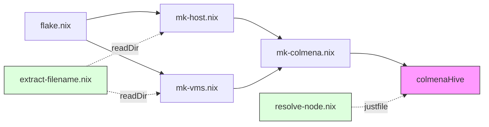

# lib/ — Colmena Hive 빌드 헬퍼

`flake.nix`에서 호출되어 Colmena hive를 조립하는 순수 Nix 함수들입니다.

```nix
# flake.nix
mkHost = import ./lib/mk-host.nix {inherit lib inputs;};
mkVMs  = import ./lib/mk-vms.nix  {inherit lib inputs;};
hive   = import ./lib/mk-colmena.nix {inherit lib inputs mkHost mkVMs;};
```

## Table of Contents

- [WHAT](#what)
- [HOW](#how)

## WHAT



| 파일 | 역할 |
|------|------|
| `mk-host.nix` | `nodes/physical/` 디스커버리 → 물리 호스트 NixOS 구성 |
| `mk-vms.nix` | `nodes/vms/` 디스커버리 → MicroVM 구성 |
| `mk-colmena.nix` | 호스트 + VM 병합, `deployment.*` 중앙 주입 → hive 반환 |
| `extract-filename.nix` | `builtins.readDir` → `.nix` 파일명 리스트 (공유 유틸) |
| `resolve-node.nix` | 노드명 → `{ip, user, type, ...}` (justfile용 해석기) |

## HOW

**노드 추가 시 자동 반영되는 구조:**

`mk-host.nix`와 `mk-vms.nix`는 `builtins.readDir`로 노드 파일을 자동 탐색합니다.
새 `.nix` 파일을 `nodes/physical/` 또는 `nodes/vms/`에 추가하면 별도 등록 없이 hive에 포함됩니다.

**`deployment.*` 처리:**

`mk-colmena.nix`가 모든 노드에 공통 deployment 모듈을 주입합니다.
`config.node.*` (IaC Contract)에서 `targetHost`, `targetUser`, `allowLocalDeployment`를 동적으로 도출합니다.

**관련 라이브러리:**
- [Colmena — makeHive](https://github.com/zhaofengli/colmena)
- [microvm.nix — host/guest modules](https://github.com/astro/microvm.nix)
