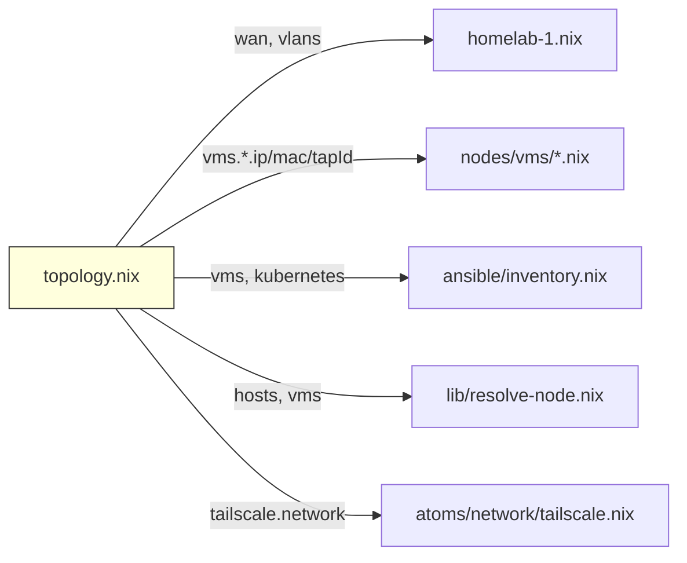

# network/ — 네트워크 토폴로지 상수

WAN, VLAN, Tailscale, Kubernetes, VM/호스트 네트워크 할당을 단일 파일에서 관리합니다.
CIDR 충돌 방지와 외부 도구(justfile, ansible) 연동을 위한 중앙 레지스트리입니다.

```nix
# 사용 예
network = import ../../network/topology.nix;
network.vlans.services.gateway  # → "10.0.20.1"
network.vms.k8s-master-1.ip    # → "10.0.20.10"
network.hosts.homelab-1.user   # → "limjihoon"
```

## Table of Contents

- [WHAT](#what)

## WHAT

`topology.nix` 단일 파일 — 순수 Nix attrset (NixOS 모듈 아님).



| 섹션 | 내용 | 참조처 |
|------|------|--------|
| `wan` | WAN IP, gateway, prefix | homelab-1.nix |
| `dns` | DNS 서버 | VM 네트워크 설정 |
| `vlans` | VLAN 10 (관리) / 20 (서비스) | homelab-1.nix, VM 네트워크 |
| `tailscale` | Tailscale CGNAT 대역 + 호스트 IP | tailscale.nix |
| `kubernetes` | Pod/Service CIDR, API VIP, Cilium 버전 | ansible inventory |
| `hosts` | 물리 호스트 {ip, user} | resolve-node.nix, justfile |
| `vms` | VM별 {ip, mac, tapId} | VM nix 파일, homelab-1.nix TAP, ansible |
