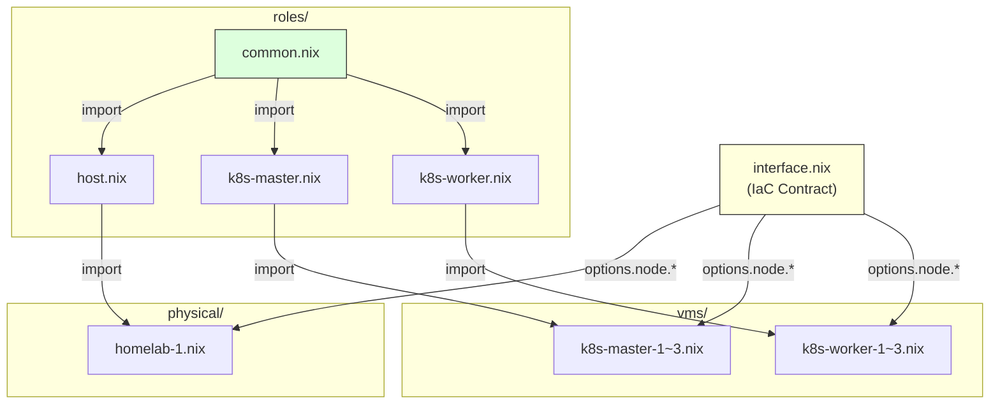

# nodes/ — 노드 정의 (IaC Contract + 역할 + 물리/VM)

모든 노드의 선언적 구성입니다. IaC Contract로 공통 인터페이스를 강제하고,
역할(Role)로 Atom 조합 전략을 정의하며, 각 노드 파일이 실제 값을 선언합니다.

```nix
# 노드 파일 최소 구조 (예: nodes/vms/k8s-master-1.nix)
{...}: {
  imports = [ ../interface.nix  ../roles/k8s-master.nix ];
  node = { ip = net.ip; mac = net.mac; role = "k8s-master"; hostType = "vm"; parentHost = "homelab-1"; };
}
```

## Table of Contents

- [WHAT](#what)
- [HOW](#how)

## WHAT



| 파일/디렉토리 | 역할 |
|---------------|------|
| `interface.nix` | IaC Contract — `node.{ip, role, hostType, mac, user, parentHost}` 옵션 + assertion |
| `roles/common.nix` | 전 노드 공통 Atom (nix, locale, shell, ssh, firewall, authorized-keys) |
| `roles/host.nix` | 물리 호스트 전용 (common + sops + tailscale) |
| `roles/k8s-master.nix` | K8s master (common + k8s atoms + master 방화벽 포트) |
| `roles/k8s-worker.nix` | K8s worker (common + k8s atoms + worker 방화벽 포트) |
| `physical/*.nix` | 물리 호스트 구성 (bridge, VLAN, TAP, NAT) |
| `vms/*.nix` | VM 노드 구성 (libvirt/QEMU 기반, systemd-networkd) |

## HOW

**노드 추가 절차 (VM):**

1. `network/topology.nix` — `vms` 섹션에 `{ip, mac, tapId}` 1줄 추가
2. `nodes/vms/<name>.nix` — 새 파일 생성 (기존 VM 파일 복사 후 수정)

`lib/mk-vms.nix`가 `builtins.readDir`로 자동 탐색하므로 별도 등록 불필요.
`homelab-1.nix`의 TAP 설정과 `ansible/inventory.nix`도 자동 반영됩니다.

**Contract 위반 시:**

`interface.nix`의 assertion이 빌드 시 검증합니다:
- VM은 `mac`, `parentHost` 필수
- `ip`는 비어있으면 안 됨
- `role`은 `["k8s-master" "k8s-worker" "host"]` 중 하나
